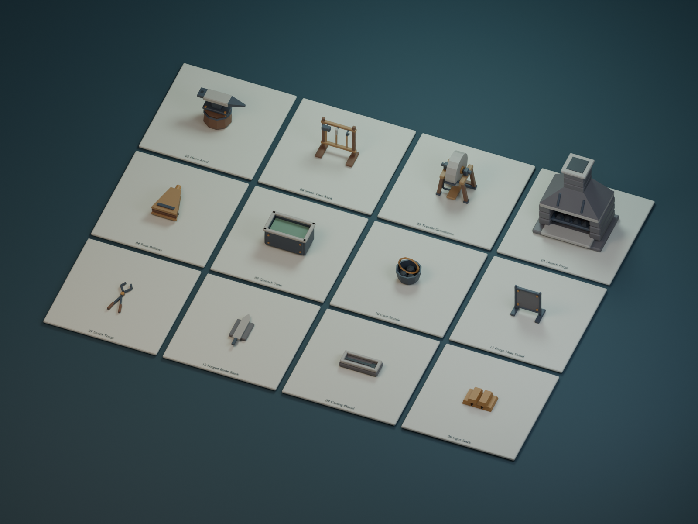
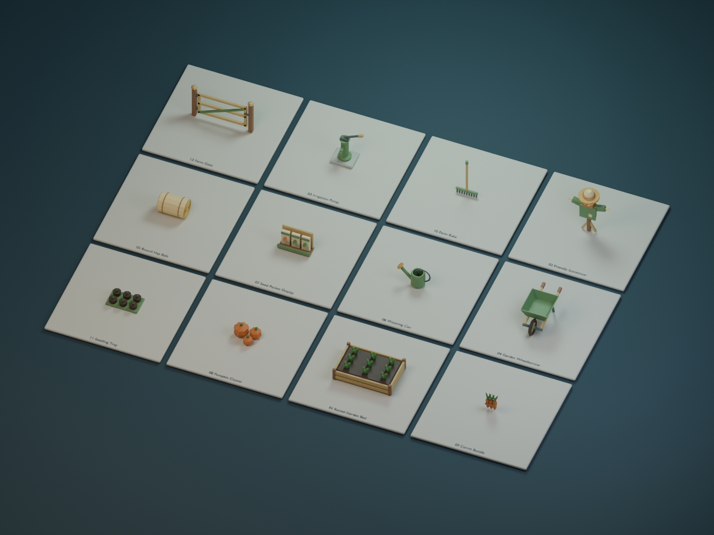
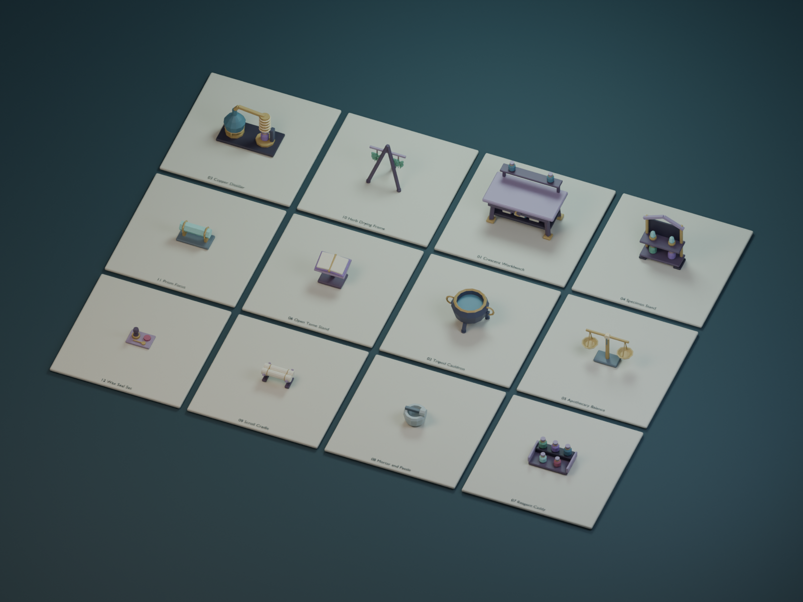
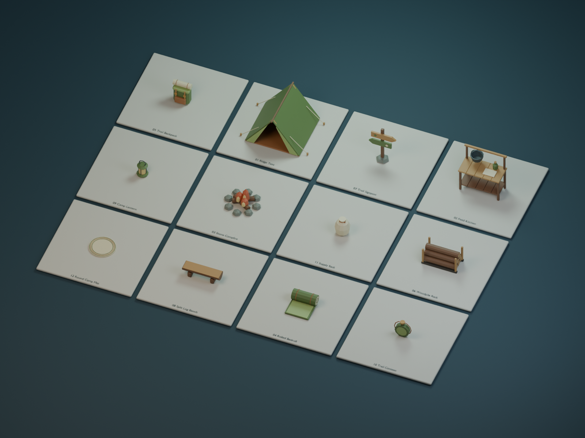
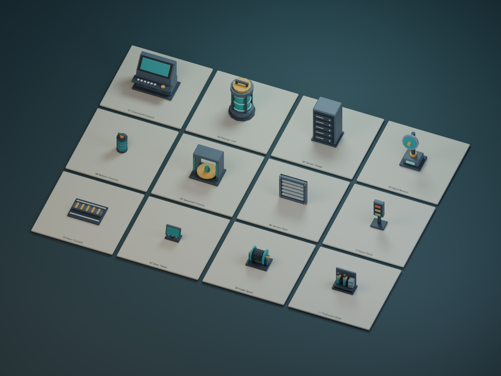
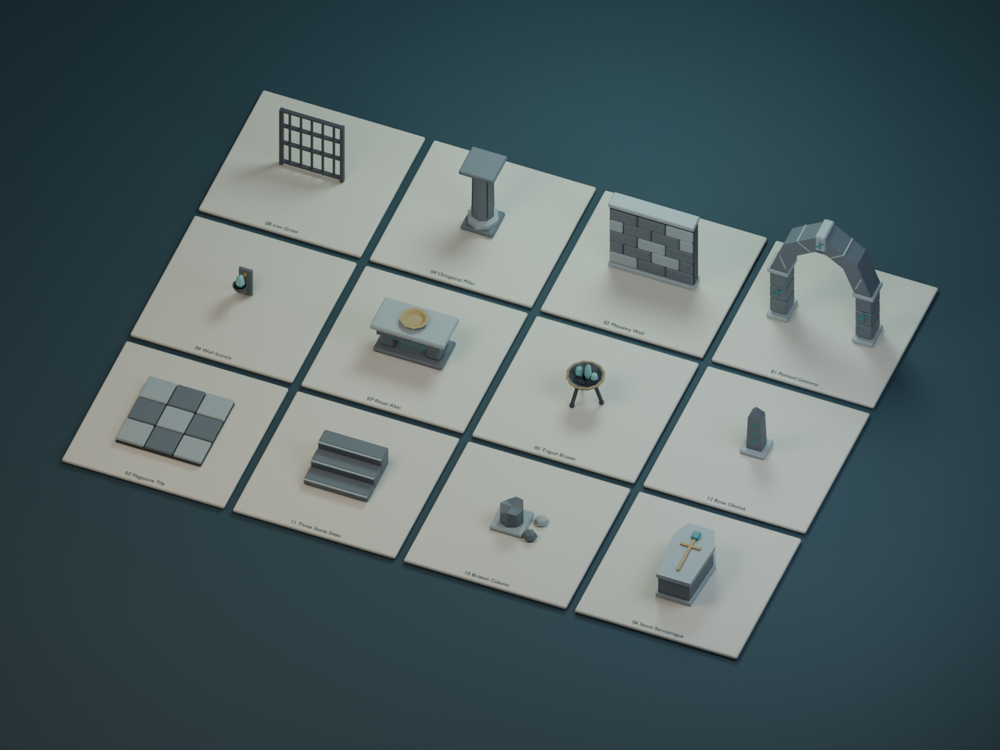
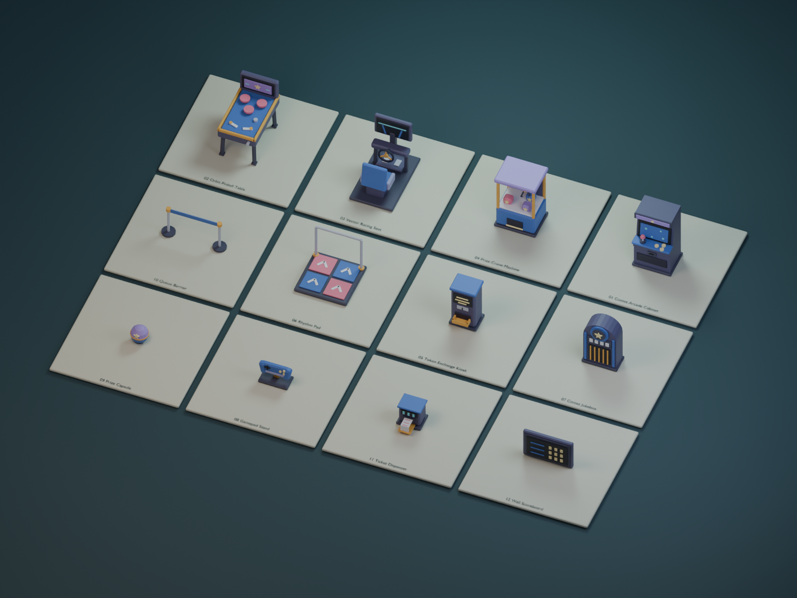
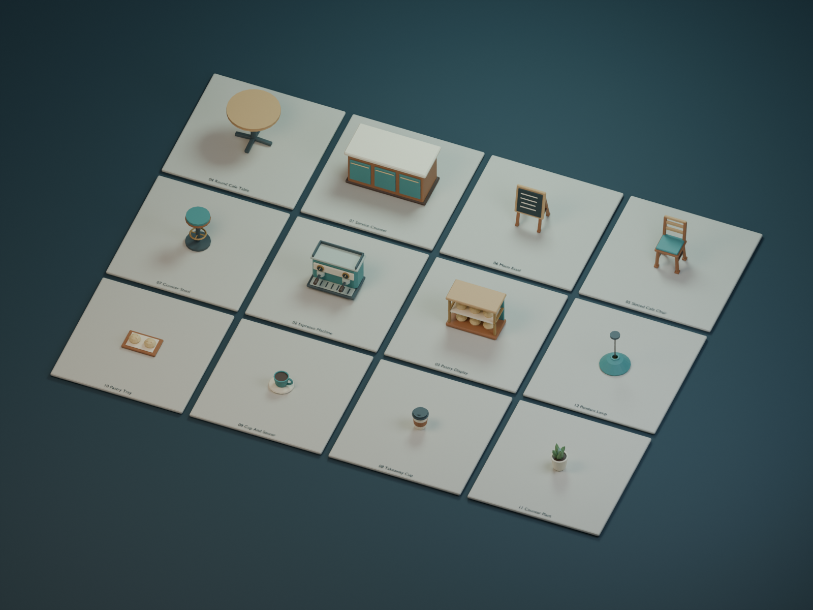
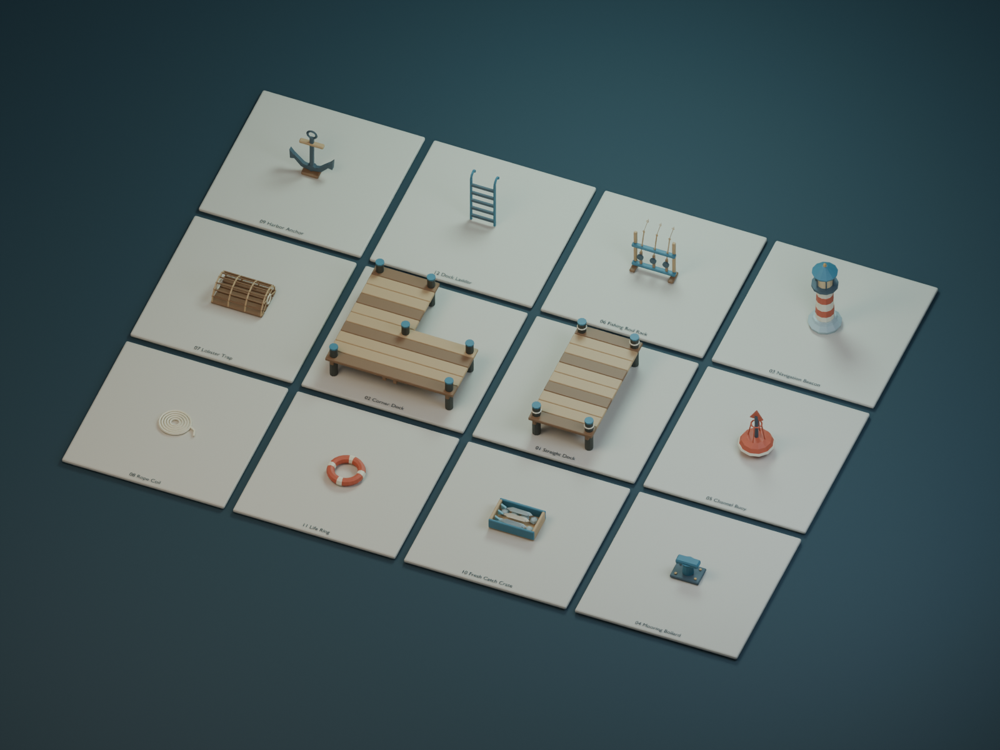

# Creator model catalog

One paid listing is live: [Gilded Grove — Merchant & Loot](https://create.roblox.com/store/asset/122456766146790/Gilded-Grove-Merchant-Loot), US$5.99 (24 original models, three palettes).

[Gilded Grove local source ZIP](../gilded-grove/delivery/GildedGrove_Full.zip)

The nine collections below contain 108 further original models. Local source, exports, images, Studio previews and ZIP checks passed. Persistent uploads and paid listings remain blocked by the recorded Studio automation approval rejection. Intended price: US$4.99 per new collection.

These local ZIP deliveries include Blender source and portable FBX/GLB files. Creator Store purchases do not automatically include the ZIP. All assets are visual props without gameplay systems.

| Collection | Models | Triangles per palette | Files |
| --- | ---: | ---: | --- |
| Emberforge Smithy | 12 | 6,044 | [ZIP](emberforge-smithy/emberforge-smithy-source-and-exports.zip) · [details](emberforge-smithy/README.md) |
| Harvest Homestead | 12 | 8,808 | [ZIP](harvest-homestead/harvest-homestead-source-and-exports.zip) · [details](harvest-homestead/README.md) |
| Moonwell Alchemy | 12 | 9,268 | [ZIP](moonwell-alchemy/moonwell-alchemy-source-and-exports.zip) · [details](moonwell-alchemy/README.md) |
| Mossvale Camp | 12 | 6,760 | [ZIP](mossvale-camp/mossvale-camp-source-and-exports.zip) · [details](mossvale-camp/README.md) |
| Neon Relay Lab | 12 | 7,158 | [ZIP](neon-relay-lab/neon-relay-lab-source-and-exports.zip) · [details](neon-relay-lab/README.md) |
| Runestone Dungeon | 12 | 6,292 | [ZIP](runestone-dungeon/runestone-dungeon-source-and-exports.zip) · [details](runestone-dungeon/README.md) |
| Starfall Arcade | 12 | 9,466 | [ZIP](starfall-arcade/starfall-arcade-source-and-exports.zip) · [details](starfall-arcade/README.md) |
| Sunbeam Cafe | 12 | 8,180 | [ZIP](sunbeam-cafe/sunbeam-cafe-source-and-exports.zip) · [details](sunbeam-cafe/README.md) |
| Tidewatch Harbor | 12 | 11,282 | [ZIP](tidewatch-harbor/tidewatch-harbor-source-and-exports.zip) · [details](tidewatch-harbor/README.md) |

## Emberforge Smithy

## Harvest Homestead

## Moonwell Alchemy

## Mossvale Camp

## Neon Relay Lab

## Runestone Dungeon

## Starfall Arcade

## Sunbeam Cafe

## Tidewatch Harbor

