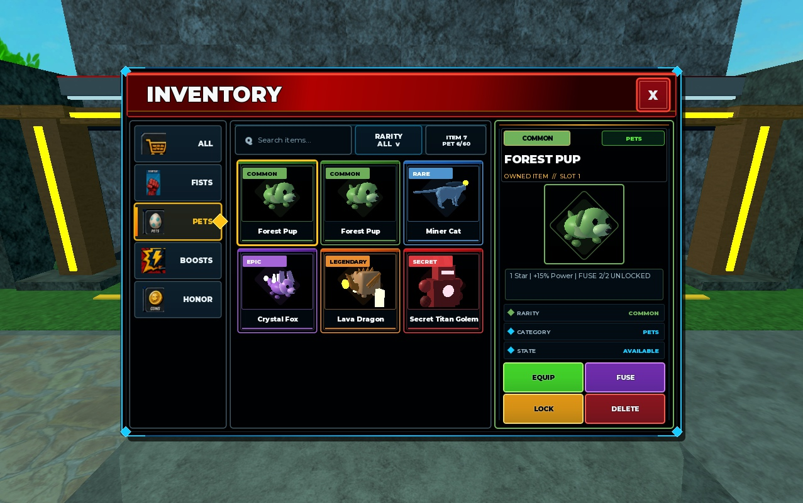

# Inventory Pet Icons and Fusion QC — 2026-08-18

## Result

PASS for the in-scope current-source candidate. No known in-scope product
defect remains after the final single-attempt Studio runs.

The Inventory no longer maps every pet to one generic image. Each pet card and
the selected detail panel render a sanitized, species-specific clone from the
same visual builder used by the equipped companion. Pet actions now include a
purple `FUSE` control; four pet actions use a balanced 2x2 layout.

## Candidate and runtime identity

- Working tree: `F:\Roblox\PuchWall-inventory-integration`
- Branch: `codex/feature/inventory-integration`
- Studio instance: `6d29b2d4-41ab-41fb-838f-3dfd8727c725`
- Place: `PunchWallRPG_ManualPlaytest_20260818_FistAuraV10.rbxlx`
- DataModel was verified back in Edit mode after each flow.
- Source sync covered all nine canonical modules before runtime verification.

## Final Studio evidence

### `inventory-pet-icons-fusion` — PASS

- 6 visible cards / 6 ready model previews.
- 5 distinct species identities: Forest Pup, Miner Cat, Crystal Fox, Lava
  Dragon, and Secret Titan Golem.
- Card and detail `ArtMode`: `ModelMatchedViewportV1`.
- Four actions, two columns; Fusion style is `Fusion` and is enabled only when
  requirements are met.
- Pressing the public Inventory Fusion action consumed exactly two unlocked
  1-star Forest Pups and created one `Forest Pup#2`.
- The next 2-star fusion correctly required three copies and stayed disabled
  with only one copy.
- A 5-star pet displayed `MAX STAR`, stayed disabled, and did not dispatch.
- Post-stop console contained no unexpected warning/error.

### Regression flows — PASS

- `inventory-visual-responsive`: desktop and narrow phone; UI scale 80%, 100%,
  and 120%; bounds, no-overlap, text fit, touch size, and two-column pet action
  layout all passed.
- `inventory-menu-ui`: complete desktop and compact Inventory regression,
  including filters, selection, fist equip, boost expiry, duplicate pet
  equip/lock/delete boundaries, confirmation timeout, mobile drawer, rarity
  menu, close/restore, and clean consoles.

The first `inventory-menu-ui` run reached the compact screen with correct
runtime output (`actionCount=4`, all geometry checks true) but the old flow
still expected three actions. The stale test expectation was corrected to four
and the complete flow then passed. This was a test-contract mismatch, not a
runtime defect.

## Static gates

- Full automation static suite: PASS.
  - Node syntax: 21 files.
  - PowerShell syntax: 18 files.
  - Luau: 9 files x O0/O1/O2 = 27 compile cases.
  - Flow JSON: 101 files.
  - Runner: 11 checks.
  - Infrastructure: 25 checks.
  - Economy: 10 checks.
  - Fist flow: 11 checks.
  - Persistence: 28 checks.
- Inventory visual fidelity: 19/19 PASS, including the new species-specific
  preview and Fusion contract.
- Inventory responsive contract: 42/42 PASS.
- `git diff --check`: PASS (line-ending notices only).

## Visual evidence

## Generated portrait pack

Eight transparent 512x512 upload candidates and their hashes are documented
in `work/assets/generated/pet-inventory-icons-v1/README.md`.

Roblox clients cannot load repository-local PNG paths. Therefore the current
runtime uses exact model previews immediately. When the owner uploads the eight
project-owned PNG files, populate `GameConfig.PetInventoryArt` with the returned
`rbxassetid://` IDs; the model preview remains the safe fallback. This external
upload step does not block distinct, correct pet identities in the current UI.
